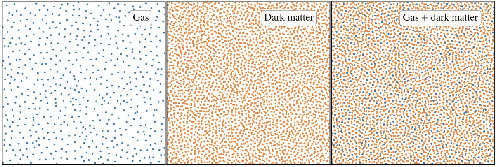

## Gadget-2Glass: Generating two-component particle loads for cosmological simulations with dark matter and baryons

---



Gadget-2Glass is a code for generating two-component, glass-like particle loads for cosmological simulations with dark matter and gas. It is based on the publicly available Gadget-2 code by Volker Springel ([Link](https://wwwmpa.mpa-garching.mpg.de/gadget/)). This code accompanies the paper:

**Particle loads for cosmological simulations with equal-mass dark matter and baryonic particles**  
Liao et al. (2025)  
[arXiv:xxxx.xxxxx](https://arxiv.org/abs/xxxx.xxxxx)

---

### Overview

Traditional cosmological hydrodynamical simulations usually use equal-number but unequal-mass dark matter and gas particles in the initial conditions. However, recent studies have shown that this setup leads to spurious collisional heating and can affect galaxy properties. This code aims to generate a glass-like two-component particle load that can be used to create initial conditions with unequal-number but equal-mass dark matter and gas particles.

The general idea behind our method is as follows: while relaxing the combined two-component particle system under a repulsive force--similar to the traditional glass-making method--we also introduce an additional, component-specific repulsive force for each particle type. The total repulsive force ensures that all particles avoid each other, while the component-specific repulsive force helps particles of the same type stay further apart.

Please refer to Liao et al. (2025) for more details.

### Installation

Clone the repository:
```
git clone https://liaoshong@bitbucket.org/liaoshong/gadget-2glass.git
cd gadget-2glass
```

The installation procedure is the same as for the original Gadget-2 code. It requires several non-standard libraries, including MPI, GSL, FFTW2, and HDF5 (optional). After installing these libraries, please edit ```Makefile``` to adjust it to your system.

### Usage

#### (i) Makefile and compilation

The provided ```Makefile``` has been used to generate the particle load in Liao et al. (2025) and serves as an example for generating two-component particle loads. Compared to the original Gadget-2 code, the only new complilation option is ```MAKEDOUBLEGLASS```. All code modifications are wrapped within this macro in the source files. 

If you prefer not to use HDF5, please comment out the ```HAVE_HDF5``` option in the ```Makefile```.

Once ```Makefile``` is properly edited, compile the code by running:
```
make
```

#### (ii) Parameter file

The file ```glass_example.param```, which was used in Liao et al. (2025), provides an example to set parameters for Gadget-2Glass. Compared to the original Gadget-2 parameter file, two new parameters are introduced:

* ```glassPartNumType1```: number of particles of type 1 (e.g., gas)
* ```glassPartNumType2```: number of particles of type 2 (e.g., dark matter)
* ```glassNoAddForceStepNum```: number of steps for evolving the two-component glass after switching off the additional force terms from the same component. A recommended value is 20. See Liao et al. (2025) for details.

For example, in the provided file, the particle numbers are 262144 and 1402203, which generates a particle load with 262144 gas and 1402203 dark matter particles.

Please refer to the original Gadget-2 user guide for the explanations of other parameters.

Note:

* Since only gravity is considered when generating the two-component particle loads, we use types 1 and 2 for the two particle sets (note that in GADGET, gas particles are assigned type 0). When using the generated particle loads to create initial conditions for GADGET cosmological simulations, please take care to correctly assign one set as gas and the other as dark matter.
* If HDF5 is not used, set the parameter ```SnapFormat``` to 1 (Gadget-2 default file format) or 2 (a variant of the default fileformat) in ```glass_example.param```.

#### (iii) Running the code

Running the code is the same as the original Gadget-2 code. For example:
```
mpirun -np 16 ./Gadget2 glass_example.param
```

After the run completes, the final output snapshot can be used as the glass-like two-component particle load.

### License

GADGET is free software, distributed under the GNU [General Public License](https://www.gnu.org/licenses/gpl-3.0.html). This implies that you may freely distribute and copy the software. You may also modify it as you wish, and distribute these modified versions as long as you indicate prominently any changes you made in the original code, and as long as you leave the copyright notices, and the no-warranty notice intact. Please read the General Public License for more details. Note that the authors retain their copyright on the code.

### Contact

For questions or feedback, please contact:

Shihong Liao  
National Astronomical Observatories, CAS  
Email: shliao[AT]nao.cas.cn
